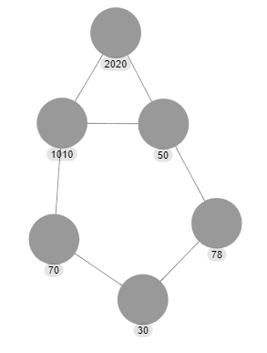

# Algorithm-project
Welcome to my school project to find biggest component and in that diameter and radius

This project was aimed to build a algorithm that finds biggest component in a massive graph, then in that same biggest component find a diameter and radius.

Functions are explained and marked by doxygen documentation.

Graph is represented in txt form as two vertexes and edge between them
For instance this small graph:

is represented in txt form like that:

1010 2020

1010 50

2020 50

50 78

78 30

30 70

1010 70

## Test data
Test data are in files named **Grafxxx**
- Graf1 - here is the biggest Graph
- Graf3 - small Graph (for testing)
- Graf_m - small Graph (for condition testing)
- Graf_mini - small Graph witht big numbers
- Graf_mini_2 - larger Graph with big numbers
